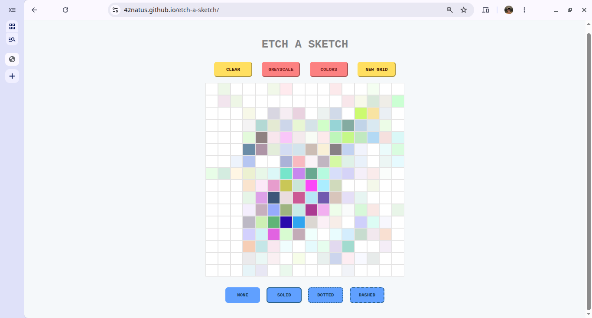

# etch-a-sketch
A grid you can "sketch" on using a mouse. Similar to the actual toy. The project is part of the curriculum of The Odin Project's **Foundations** path.

## Features

1. A 16x16 grid that acts like a canvas. It can be drawn on with a mouse.

2. The cells darken gradually each time the mouse hovers over them. There are two options for this:

    - `GREYSCALE`  
    The cells darken from light grey to black on each interaction with the mouse.
    
    - `COLORS`  
    The cells get randomly colored each time the mouse interacts with them. The colors start out really light then get darker upon each interaction with the mouse.

3. The grid can be resized to an arbitrary size within the range of 1 – 100 using the `NEW GRID` button. This limit was chosen to prevent potential delays, freezing or crashing due to high resource usage in generating more squares.

4. A `CLEAR` button to erase the sketch on the grid.

5. Four different grid styles:

    - `NONE`: The cells on the grid would have no outlines resulting in a blank white canvas.

    - `SOLID`: The cells would have solid outlines.

    - `DOTTED`: The cells would have dotted outlines.

    - `DASHED`: The cells would have dashed outlines.

    Changing the grid style causes the grid to be redrawn.

## How it works

The grid is drawn in a container that takes up 35% of the viewport width and 65% of the viewport height.

The cells are then calculated based on the container's dimensions and laid out in it with flexbox. The size of the grid (defaults to 16) determines the number of cells per side of the grid.

The shading/coloring is done by increasing the opacity of the color assigned to each cell every time the mouse enters the cell. This color could be black (on `GREYSCALE`) or random (on `COLORS`).

## Live Demo

Check it out [here](https://42natus.github.io/etch-a-sketch/).

## Screenshot

